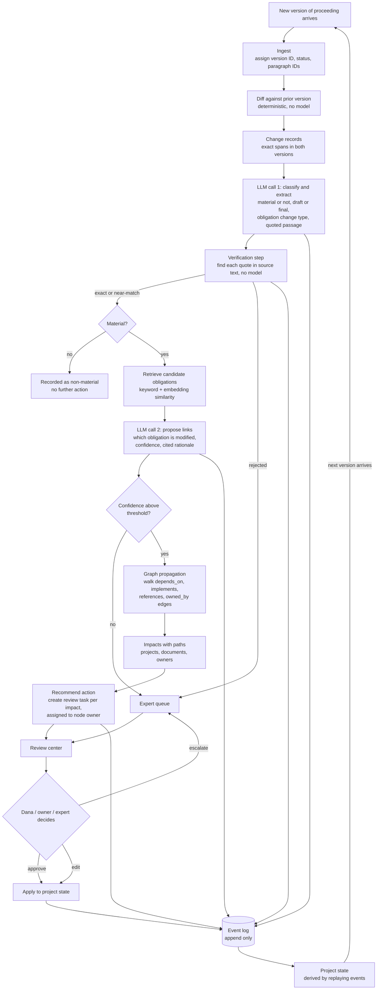

# Strata PRD: Regulatory Change-to-Action Workspace

Version 0.2, draft for review. Author: Mukesh Jain.

This document specifies the requirements for the Strata prototype. Each requirement in
Section 5 has acceptance criteria. Each criterion is implemented as a test or as a row
in the eval gold set. When a design decision changes during the build, this document is
updated in the same commit as the code.

## 1. Problem

A utility's regulatory affairs team is responsible for knowing what the rules are and
what the company must do about them. Rules arrive through proceedings. A commission
publishes a proposed rule, receives comments, publishes a revised draft, and issues a
final order. Each stage is a new version of roughly the same document. For each new
version, the team has to work out what changed, whether the change is still open for
comment or now binding, which of the company's existing obligations it modifies, which
projects and internal documents depend on those obligations, who needs to review it,
and what action follows.

Today this work is done by hand. In the discovery conversations behind this spec, a
regulatory affairs function at a multi-state investor-owned utility described 12 to 15
people per state, with 20 to 30 percent of their time spent on research. They work
across docket websites, Word memos, spreadsheets, email, and the memory of a few senior
people. When a change is large, the team pays an outside consultant several hundred
thousand dollars to survey how other states handled the same issue. The same question
comes up in the next state a year later, and the earlier answer is not reused. Research
memos are out of date soon after they are written, and the knowledge leaves with the
people who wrote them.

The team already uses general-purpose AI to find information. They do not use it to
interpret changes or assess impact. The impact memo goes to management and, eventually,
to a regulator, and an analyst will not sign a memo whose citations they cannot verify.
Their own description of how they use consultants was as accreditation: "this
consultant said yes, so we're good." An AI output carries no such standing. As a
result, the split today is roughly 20 percent AI and 80 percent human, and the human
part is the expensive part.

## 2. Who this is for

The user is the regulatory affairs analyst who owns the company's response to a
specific proceeding. Call her Dana. She works at a multi-state investor-owned utility
and reports to a director of regulatory affairs. Her name goes on the internal impact
memo, and she drafts the company's next filing. She is an expert in the rules and a
generalist with software. She is measured on being right, being on time, and never
surprising her director with something she should have known about.

When a new version of a proceeding is published, Dana downloads the PDF, opens the
prior version beside it, reads both, marks what changed, decides which changes matter,
writes a memo listing each material change with the paragraph it came from and what
the company must do, emails the memo to the people who own the affected work, and waits
for them to confirm. When the next version is published, she does this again, usually
from a blank page.

Dana needs five things she does not have today. She needs to see what changed between
versions without reading both in full. She needs confidence that every claim in the
memo points at real text. She needs a record of which obligations, projects, and
documents each change touches, so she does not miss one. She needs a way to route
review to the right owners and track that it happened. And she needs the project to
carry forward across versions, so the memo for v3 builds on the work done for v2.

Two other roles appear in the workflow. Owners are the people responsible for the
obligations, projects, and documents in the company graph. Strata routes review tasks
to them when a change affects something they own. Experts are senior reviewers,
typically regulatory counsel or the director, who resolve items Strata is not confident
about. In the prototype, owners and experts are assignees, not users. Dana is the only
person who uses the tool, and she sees the tasks assigned to each of them.

The general counsel, the compliance officer, and outside consultants are readers of
Dana's output. This spec does not design for them directly. The product serves them
through Dana.

## 3. Why alerts and search are not enough

Docket alert services tell Dana that a document was filed. Enterprise search tells her
where a phrase appears. Neither tells her what changed between two versions, whether
the document is draft or final, which of her company's obligations the change modifies,
or who has to act. Those are the questions that take her time, and both kinds of tool
leave them to her.

General-purpose LLM assistants can answer those questions in prose, and Dana has tried
them. The output reads well. Sometimes it cites a paragraph that does not exist or a
deadline from a different section. She cannot tell which parts are wrong without doing
the reading herself, so the assistant saves her nothing on the step that matters.
Nothing in the tool vouches for the output, and nothing connects the output to her
company's own obligations and projects.

Strata addresses both gaps. Every claim it makes is checked mechanically against the
source text before Dana sees it. Every impact it reports is a traceable path through
the company's own obligations, projects, and documents. Anything it is not confident
about is routed to an expert for review rather than presented as a finding.

## 4. The first workflow: change to action for one proceeding

The workflow for one proceeding across its versions:

1. Dana creates a project for the proceeding and loads the current version. The
   company's obligations, projects, documents, and owners are already in the workspace.
2. When a new version arrives, she loads it. Strata diffs it against the prior version
   and produces a list of changes, each anchored to exact passages in both versions.
3. For each change, Strata classifies it as material or not, determines whether the
   version is draft or final, and states what obligation change it represents. Every
   claim carries a quoted passage. Strata's verification step checks each quote
   against the source text, without using the model, and marks it verified,
   near-match, or rejected.
4. For each verified material change, Strata identifies the obligation it modifies and
   walks the company graph to find the projects, documents, and owners downstream. It
   reports the path for each impact.
5. Strata recommends an action for each impact and creates a review task assigned to
   the owner of the affected node. Any change with a rejected citation or a
   low-confidence mapping is assigned to the expert queue instead, and is not applied
   until an expert resolves it.
6. Dana works the review center. She approves, edits, or escalates each item. Every
   decision is recorded. The project state reflects approved changes only, and she can
   view the state as of any prior point.
7. When v3 arrives, steps 2 through 6 run again against the state that v2 produced.

The prototype implements this workflow for one synthetic proceeding with three versions
and one synthetic company.

The diagram below shows the flow from a new version arriving to the updated project
state. Steps marked "no model" are deterministic code.

## 5. Requirements and acceptance criteria

Each criterion is tagged T (deterministic test), E (eval against the gold set), or
M (manual check in the prototype).

### 5.1 Ingest versions and company context

- R1.1 The system accepts successive versions of a proceeding as text and assigns each
  a version ID, a status (proposed, revised, final), and stable paragraph IDs. T
- R1.2 The system loads a company context of obligations, projects, documents, and
  people, with typed relationships between them. T
- R1.3 Every paragraph in every version is addressable by ID and character span, so
  any claim can point at exact text. T

### 5.2 Detect changes, distinguish draft from final, cite sources

- R2.1 Given two consecutive versions, the system produces change records at paragraph
  granularity with exact spans in both versions. No model is involved in this step. T
- R2.2 Each change is classified material or not. A footnote renumbering and a
  cosmetic rewording with no substantive change are classified not material. E
- R2.3 Each version is classified draft or final. A version whose only signals of
  finality are the status line and an effective-date sentence is classified final. E
- R2.4 Every claim about a change carries a quoted passage and a version and paragraph
  reference. A verifier confirms the passage exists in the referenced text. An exact
  match is verified. A small edit distance is near-match, with the distance recorded.
  Anything else is rejected. The quote must also overlap the span the diff identified
  as changed; a quote taken from unchanged text in the same paragraph is rejected. T
- R2.5 A claim whose quote comes from a nearby but different passage is rejected by
  the verifier. T, E
- R2.6 An obligation that is removed in a later version is detected as a removal. E

### 5.3 Map changes to obligations, projects, documents, and route

- R3.1 For each verified material change, the system identifies the obligation node or
  nodes it modifies from a short candidate list, with a confidence score and a cited
  rationale. E
- R3.2 Downstream impacts (projects that depend on the obligation, documents that
  implement it, projects referenced by those documents) are found by deterministic
  graph traversal. Each impact reports its path. An impact reachable only two hops away
  is found. T
- R3.3 Each impact carries a recommended action and is routed to the owner of the
  impacted node. T
- R3.4 A change that modifies two obligations at once produces impacts for both. E

### 5.4 Living, auditable state and escalation

- R4.1 Every extraction, verification result, mapping, routing decision, and human
  action is recorded as an event with a timestamp and an actor. T
- R4.2 Project state is derived from the event log. The state as of any prior event can
  be reconstructed. Rolling back to a prior state is a recorded action, and no events
  are deleted. T
- R4.3 Any claim with a rejected citation, and any mapping below the confidence
  threshold, is routed to the expert review queue. It is not applied to project state
  until a human approves it. T
- R4.4 Human edits and overrides are preserved across versions. A mapping Dana
  corrected for v2 is not re-proposed for v3. T
- R4.5 The review center shows, for each item, the claim, its verification status, its
  confidence, the impacted nodes with paths, and the recommended action. Dana can
  approve, edit, or escalate each item. M

### 5.5 Out of scope for the prototype

The prototype does not include authentication and roles, multi-tenant data isolation
beyond a single company namespace, live docket ingestion from commission websites, PDF
parsing, multiple jurisdictions, notifications, or integrations with compliance or
document systems. The TDD discusses each of these as a design consideration.

## 6. Trust and adoption metrics for expert users

These metrics measure whether Dana trusts the output enough to act on it.

Citation fidelity is the fraction of claims whose quotes verify exactly, verify as
near-matches, or are rejected. The prototype target is that no unverified claim reaches
Dana. The rejection rate is reported rather than hidden, because a rising rejection
rate is the earliest signal that the model's behavior has changed.

Override rate is the fraction of proposed mappings and actions that Dana edits or
rejects in review. It will be high at first. The trend across versions is the adoption
signal. If it does not fall, the product is not learning her company and is not earning
her trust.

Time to memo is the elapsed time from loading a version to an approved impact set. The
baseline from discovery is days to weeks, with consultant involvement. The prototype
target is one review session.

Escalation precision is the fraction of items routed to expert review where the expert
agreed that escalation was warranted. A low value means the threshold is too cautious
and Dana is doing the work anyway. A high value with many misses elsewhere means the
system is guessing.

Coverage is the fraction of gold-set impacts found, including multi-hop impacts. A miss
here is the failure Dana fears most, because it means being surprised by something she
should have known.

Beyond these metrics, three behaviors indicate adoption: Dana opens the review center
when a version is published instead of opening the PDF, she forwards Strata's impact
list instead of writing her own, and the project for v3 starts from v2's state instead
of from a blank page.

## 7. User evidence

The direct evidence for this spec comes from a demo and feedback session held the week
before this challenge with the utility team building an internal version of this tool
and with the analysts using it. The statements that shaped the spec were these.
Research takes 20 to 30 percent of the time of a 12 to 15 person per-state team. A
single cross-state study cost several hundred thousand dollars in consulting. Users
adopted the Q&A feature first because it was the easiest to understand, and the team
building the tool said not to read too much into that. The review center is where users
should spend their time, and alerting and collaboration were not yet built. The largest
adoption barrier named was that consultants provide accreditation and an AI output does
not. One team stated its goal as moving from 20 percent AI to 80 percent AI by focusing
human attention on the review step.

Those statements led to four decisions. The verifier exists because trust was the named
barrier. The review center is the primary screen because that is where the human 20
percent lives. Impacts are shown as graph paths because "what does this affect" was the
manual step users described. Project state persists across versions because losing
context between versions and between people was the recurring complaint.

Three things remain unvalidated: whether Dana accepts a verified-citation badge as
sufficient to sign a memo, whether the confidence threshold for escalation matches her
tolerance, and whether path-based impact explanations are readable to someone who is
not an engineer. If the residency proceeds, the first week of discovery is to sit with
two analysts through one live version each, note where they go to the PDF instead of
the tool, and instrument override and escalation rates from the first day.

## 8. Expansion beyond utilities

The mechanism applies to any regulated enterprise. Each one receives successive
versions of binding text, has internal obligations derived from that text, and has
projects and documents that depend on those obligations. What changes across industries
is the source corpus, the taxonomy of obligation types, and the reviewer roles. The
graph model, the verifier, the event log, and the review workflow carry over unchanged.

The expansion sequence is: the same utility's supply chain and corporate strategy teams
first, because they share the company graph and the buyer; then other utilities through
the same practice-area entry point; then adjacent regulated industries, such as pharma
and medical devices, financial services, and telecom, where the consultant-replacement
economics are similar and often larger. The go-to-market pattern follows a consulting
firm's: enter with one practice area sold to one team with an existing budget, then
expand within the account. The first generalization test is whether the obligation
taxonomy and the mapping prompts work for a second industry without being rebuilt. That
single question decides whether the market is tens of millions or billions.

## 9. Decisions

- The proceeding versions and the company context are built as part of this
  prototype, as synthetic data.
- The confidence threshold for escalation is 0.7 for the prototype. It will be tuned
  against the override rate.
- Near-match citations are shown to Dana with the edit distance and a distinct badge.
  They are not routed to review.
