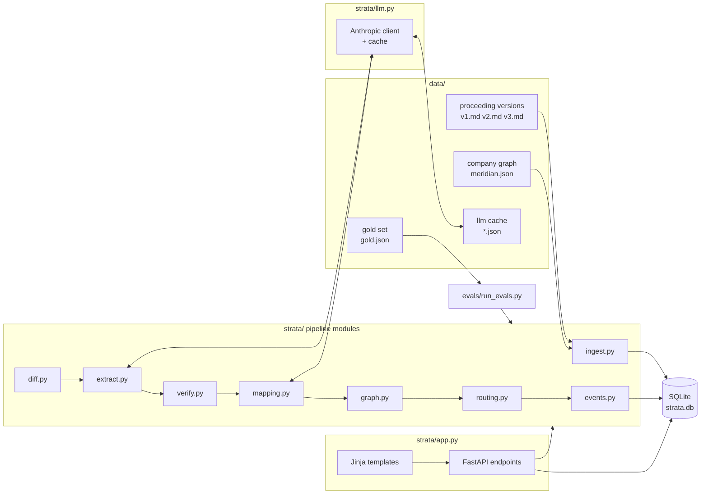

# Strata TDD: Technical Design

Version 0.3, draft for review. Author: Mukesh Jain.

This document specifies the technical design of the Strata prototype. For each
component it states what is built, which alternatives were considered, and why they
were rejected. References to PRD sections are written as PRD 5.x.

## 1. System overview

Strata is a Python application. All logic lives in Python modules with plain function
interfaces. FastAPI exposes those functions as HTTP endpoints and renders HTML pages
from templates. SQLite stores all data. The Anthropic API is called in two places, and
every call is cached to disk so the system runs without an API key.



### 1.1 Stack decisions

The whole system is written in Python. The work the challenge scores is text diffing,
fuzzy matching, graph traversal, event replay, and evaluation, and Python has mature
libraries for each of these. We considered TypeScript with Next.js end to end and
rejected it because the libraries for the scored work are thinner there. We also
considered a Python backend with a React frontend and rejected it because it adds a
second runtime and a second codebase for a UI the challenge does not score.

The web framework is FastAPI. It turns a function into an endpoint with one decorator,
validates request inputs from type hints, and serves templates through Jinja2. We
considered Django and rejected it because its ORM, admin, and conventions would take
longer to explain than they save. Flask would also work; FastAPI's request validation
is the reason to prefer it.

The database is SQLite. It is one file, needs no server, and ships with Python, so a
reviewer runs one command with nothing to install or start. Postgres is the production
choice, and nothing in the schema prevents that change.

The UI is server-rendered HTML through Jinja2 templates. The interface has three pages
and no client-side state, so templates keep the whole product in one language.

Other dependencies are pytest for tests, `difflib` from the standard library for
diffing, `rapidfuzz` for edit distance, and the `anthropic` SDK for model calls. There
are no other runtime dependencies.

### 1.2 Repository layout

```
strata/
  README.md              exact run and test commands
  PRD.md
  TDD.md
  WALKTHROUGH.md         core loop traced file by file, for interview prep
  NOTES.md               what the AI wrote vs rewrote, bugs and fixes, kept during build
  Makefile               make run, make test, make eval, make reset
  pyproject.toml
  .env.example           ANTHROPIC_API_KEY=
  data/
    proceeding/
      v1.md  v2.md  v3.md
    company/
      meridian.json
    gold/
      gold.json
    llm_cache/           recorded model responses, committed
  strata/
    __init__.py
    models.py            dataclasses for every record type
    db.py                SQLite schema and connection
    ingest.py            versions and company graph -> tables
    diff.py              version pair -> change records
    extract.py           change record -> claims (LLM call 1)
    verify.py            claim -> verification result
    mapping.py           verified change -> obligation links (LLM call 2)
    graph.py             obligation -> downstream impacts with paths
    routing.py           impacts -> review tasks, escalation
    events.py            append, replay, rollback
    pipeline.py          run_version(version_id): the core loop
    llm.py               Anthropic client with disk cache
    app.py               FastAPI app and routes
    templates/           review.html, queue.html, audit.html
  evals/
    run_evals.py
    results.md           committed output of the last run
  tests/
    test_ingest.py  test_diff.py  test_verify.py  test_graph.py
    test_routing.py test_events.py test_pipeline.py test_app.py
```

## 2. Data model

Every record has a stable string ID. Claims cite text by ID, and events refer to what
they changed by ID.

### 2.1 Proceeding versions and paragraphs

A version file is markdown with a fixed header block followed by numbered paragraphs.

```
---
docket: 26-0412-RM
title: Rulemaking on Interconnection Procedures for Energy Storage Resources
version: 2
status: revised_proposed        # proposed | revised_proposed | final
issued: 2026-05-14
effective:                       # empty until final
---

## Background
[1] The Commission opened this docket ...
[2] Comments were received from ...

## Ordering Paragraphs
[3] Each electric utility shall complete ...
```

`ingest.py` parses the header into a `Version` row and each `[n]` paragraph into a
`Paragraph` row with `version_id`, `para_id` (for example `v2:p3`), `section`, `text`,
and `char_start` and `char_end` within the file. The status field in the header is
stored, and the pipeline does not rely on it. The draft-or-final classification is
made by the model from the document text, and the evals compare that classification to
the header value.

We considered parsing real PDFs and rejected it for the prototype. PDF layout extraction
is its own project and the challenge does not score it. The paragraph-ID convention is
what a PDF parser would need to produce, so the rest of the pipeline is unchanged when
one is added.

### 2.2 Change records

`diff.py` produces one `Change` for each paragraph that differs between two versions.

```
Change(
  change_id="c:v1->v2:p3",
  from_version="v1", to_version="v2",
  para_id_from="v1:p3", para_id_to="v2:p3",
  kind="modified",                # added | removed | modified
  spans_from=[(120, 210)],        # character ranges in the from paragraph
  spans_to=[(120, 206)],
  text_from="...", text_to="...",
)
```

Paragraphs are aligned by running `difflib` over the sequence of paragraph texts, so a
paragraph that shifted position because another was inserted or deleted comes back as
unchanged and emits nothing. Within a replace block of equal length, paragraphs pair by
position; an unequal block, where one side must drop out, is paired by text similarity
at a 0.6 threshold. `change_id` marks the kind, because a removal and a modification in
the same block can otherwise collide on one paragraph number: `c:v2->v3:p15` for a
modification (the from-paragraph), `c:v1->v2:+p17` for an addition (the to-paragraph),
`c:v2->v3:-p14` for a removal.
Within a modified paragraph, `difflib.SequenceMatcher` at word level produces the
changed spans.

We considered sentence-level diffing with a sentence splitter and rejected it.
Regulatory text has long sentences with internal numbering that confuses splitters,
and word-level spans inside a paragraph give tighter citations.

### 2.3 Claims and verification results

`extract.py` produces `Claim` records from a change.

```
Claim(
  claim_id="c:v1->v2:p3:k1",
  change_id="c:v1->v2:p3",
  material=True,
  version_status="draft",        # draft | final, judgment about to_version
  obligation_change="modified",  # created | modified | removed | none
  summary="Study deadline shortened from 45 to 30 business days.",
  quote="shall complete the interconnection study within thirty (30) business days",
  quote_para_id="v2:p3",
  model_confidence=0.92,
)
```

`verify.py` produces one `Verification` per claim.

```
Verification(
  claim_id="c:v1->v2:p3:k1",
  status="verified",             # verified | near | rejected
  match_start=132, match_end=204,
  edit_distance=0,
  overlaps_change=True,
  reason=None,                   # populated when rejected
)
```

### 2.4 Company graph

The company graph is stored in `data/company/meridian.json`.

```json
{
  "nodes": [
    {"id": "OBL-3", "type": "obligation", "name": "Storage interconnection study deadline",
     "text": "Complete interconnection studies for storage under 5 MW within 45 business days.",
     "owner": "P-2", "source_para": "v1:p3"},
    {"id": "PRJ-1", "type": "project", "name": "Riverside solar plus storage",
     "text": "...", "owner": "P-2"},
    {"id": "DOC-1", "type": "document", "name": "Interconnection procedures manual",
     "text": "...", "owner": "P-3"},
    {"id": "P-2", "type": "person", "name": "Interconnection manager"}
  ],
  "edges": [
    {"from": "PRJ-1", "to": "OBL-3", "type": "depends_on"},
    {"from": "DOC-1", "to": "OBL-3", "type": "implements"},
    {"from": "DOC-4", "to": "PRJ-1", "type": "references"}
  ]
}
```

Node types are obligation, project, document, and person. Edge types are `depends_on`
(project to obligation), `implements` (document to obligation), and `references`
(document to project). An obligation's source paragraph is stored as the `source_para`
field, and ownership is stored as the `owner` field, so neither needs an edge. The file
is loaded into two tables, `nodes` and `edges`.

The JSON file is the graph as it stood when the project was created. The graph the
pipeline uses is that file plus any nodes and edges added through events since (see
Section 3.9). The file on disk is never modified by the application.

We considered three flat lists with free-text descriptions, with the model deciding
impacts, and rejected it. Under that design the model has to read every project and
document on every change, the result differs between runs, and there is no way to
explain why something was or was not affected. With the graph, impact is a
deterministic walk over edges and the explanation for each impact is the path the walk
took. We also considered a graph database and the `networkx` library. Neither is needed
at 30 nodes. A dictionary of adjacency lists is enough and is fully readable.

### 2.5 Impacts, review tasks, and events

An `Impact` is a node reached by traversal from a modified obligation. It records the
path that reached it, for example `["OBL-3", "PRJ-1", "DOC-4"]`, and the edge types
along that path. A `ReviewTask` wraps an impact or a claim with `assignee`,
`recommended_action`, `status` (open, approved, edited, escalated), `queue` (owner or
expert), and, for an owner task, `paths` and `obligation_ids` holding every route that
reached the node.

An `Event` is one row in an append-only table.

```
Event(seq=41, ts=..., actor="system"|"dana"|"expert",
      type="claim_extracted"|"claim_verified"|"link_proposed"|"impact_found"|
           "task_created"|"task_approved"|"task_edited"|"task_escalated"|
           "node_created"|"edge_created"|"rollback",
      subject_id="c:v1->v2:p3:k1", payload={...})
```

Two event types grow the company graph, and their payloads are the graph's write
format. `graph.load` reads exactly these fields and `events.append` writes them, so the
shape is fixed here once rather than in each module:

```
node_created  payload={"id": "OBL-12", "type": "obligation",
                       "name": "Penalty for missed study deadline",
                       "text": "Pay $500 per business day ...",
                       "owner": "P-3", "source_para": "v2:p17"}

edge_created  payload={"from": "DOC-1", "to": "OBL-12", "type": "implements"}
```

`type` is one of obligation, project, document, person; `owner` is a person node ID;
`source_para` is the paragraph the obligation came from, or null for a node with no
source. An `edge_created` whose `from` or `to` is not a known node is ignored rather
than raising, because the log is append-only and a replay must not fail on an event
that a later rollback makes irrelevant.

Project state, meaning which claims are accepted, which impacts are confirmed, and
which tasks are open, is never stored directly. It is computed by
`events.replay(project_id, upto=None)`.

## 3. Pipeline

`pipeline.run_version(version_id)` is the core loop. It runs the stages below in order
and writes an event for each result. Each stage is a pure function over records. The
pipeline module is the only place that sequences the stages and touches the database.

### 3.1 Ingestion

Ingestion reads a version file and the company graph and writes the `versions`,
`paragraphs`, `nodes`, and `edges` tables. It is idempotent, so re-ingesting the same
file changes nothing. It fails with a clear error on a paragraph without a `[n]`
marker or on an edge that refers to a node that does not exist.

### 3.2 Version diffing

`diff.diff_versions(from_version, to_version) -> list[Change]` is deterministic and
uses no model. It produces `added`, `removed`, and `modified` changes with character
spans. A paragraph whose only difference is whitespace or a footnote marker
renumbering is still emitted as a change. Deciding that such a change is not material
is the model's job in the next stage, and the gold set checks that it does so (PRD
R2.2).

### 3.3 Evidence-linked extraction (LLM call 1)

`extract.extract_claims(change, context) -> list[Claim]`.

The model receives the changed paragraph in both versions with the changed spans
marked, the two paragraphs before and after for context, the version header block, and
instructions. It returns a JSON list of claims in the shape shown in Section 2.3. The
response is requested through the SDK's structured output feature, so it is parsed as
JSON rather than scraped from prose.

The instructions require the `quote` field to be copied verbatim from the `to` version
(or from the `from` version for removals) and to lie inside the marked changed span.
The instructions state that the verifier will reject anything else. The model also
returns `version_status` for the version as a whole, judged from the header and any
effective-date language.

We considered one call per version that returns all changes at once and rejected it. A
long context makes quote fidelity worse, and one bad response loses every claim. One
call per change keeps each prompt small and isolates each failure.

### 3.4 Citation verification

`verify.verify_claim(claim, paragraphs, change) -> Verification` uses no model. The
algorithm is:

1. Decide which paragraphs the claim is allowed to quote, from the kind of change. A
   `modified` change may be quoted from either `para_id_to` or `para_id_from`: the
   changed text of a pure deletion exists only in the from-version. An `added` change
   has only a to-side, a `removed` change only a from-side. If `quote_para_id` is not
   one of the allowed paragraphs, the status is `rejected` with reason
   `wrong_paragraph`, and no search is run. Running this check first is what separates
   a real quote lifted from a neighbouring paragraph from a quote that does not exist:
   both would otherwise report `quote_not_found`.
2. Normalize both the quote and the named paragraph's text: unify curly quotes, dashes
   and non-breaking spaces one character for one, then collapse runs of whitespace to a
   single space. Record a map from each normalized index back to the original, so every
   offset the verifier reports is in the original paragraph's coordinates and is
   directly comparable to `Change.spans_*`.
3. Search for the normalized quote in the normalized paragraph. An exact find is
   `verified` with `edit_distance=0`.
4. If the quote is not found, slide a window the length of the quote across the
   paragraph and compute `rapidfuzz.distance.Levenshtein` at each offset. The best
   window with distance at or below `max(3, len(quote) // 25)` is `near`, with the
   distance and the offset of the winning window recorded. That threshold allows a
   dropped comma or one changed word in a hundred-character quote and rejects a
   paraphrase. Recording which window won is what makes `match_start` meaningful on a
   near match, and is what the overlap check in step 5 then uses.
5. If the match, exact or near, does not overlap any changed span on the side the quote
   was taken from, the status is `rejected` with reason `quote_outside_changed_span`
   (PRD R2.4). A side with no changed spans, which happens when a modification is a pure
   word deletion, can overlap nothing and therefore rejects; the quotable text of that
   change is on the other side.
6. Otherwise the status is `rejected` with reason `quote_not_found`.

Every verification result is written as an event. A rejected claim is routed to the
expert queue with its reason, because a rejected quote on a real change is still a
change someone must look at.

We considered asking the model to check its own citations in a second call and
rejected it because that repeats the failure mode it is meant to catch. We also
considered exact matching only and rejected it because curly quotes and line-wrap
hyphens in regulatory text would reject correct quotes and teach the user to ignore the
badge.

### 3.5 Mapping to obligations (LLM call 2)

`mapping.propose_links(claim, obligations) -> list[Link]`.

The model receives the verified claim (summary, quote, change type) and the full list
of obligation nodes with their `text` fields. It returns a JSON list of
`{obligation_id, confidence, rationale, rationale_quote}`. The rationale quote is a
phrase from the obligation's text, and it is verified against that text the same way
claim quotes are verified.

With about ten obligations, the full list fits in the prompt and no retrieval step is
needed. At hundreds or thousands of obligations, a retrieval step (a keyword filter
followed by embedding similarity) would narrow the candidates first. That step is not
built. The function takes a candidate list as its argument, so a retrieval step can be
inserted without changing the call.

We considered letting the model map directly to projects and documents and rejected
it for the reasons in Section 2.4.

### 3.6 Confidence and escalation

There are two confidence values and they are kept separate. `model_confidence` on a
claim is how sure the model is about its interpretation. `confidence` on a link is how
sure the model is that this obligation is the one modified. Both are self-reported by
the model as a number from 0 to 1 with a one-line reason. They are not calibrated
probabilities, and this document does not present them as such.

The escalation rules are applied in `routing.py` in this order:

1. If the claim's verification status is `rejected`, the item goes to the expert queue
   with the rejection reason attached.
2. If any link's `rationale_status` is `rejected`, the item goes to the expert queue
   with reason `rationale_unverified`. The mapping call returns a quote from the
   obligation's own text supporting the link, checked by the same search the citation
   verifier uses; a rationale citing language the obligation does not contain is a
   reason to look at the link, even when the link itself may be right. A `near`
   rationale is tolerated, as a near citation is (PRD 9).
3. If the claim's `obligation_change` is `created`, the item goes to the expert queue
   with reason `new_obligation`. No existing node can be the right link for a new
   duty, so the mapping call is skipped for these claims, and rule 2 cannot fire for
   them because they have no links.
4. If any link has `confidence` below 0.7, the item goes to the expert queue with
   reason `low_confidence`.
5. If the claim has `obligation_change` of `modified` or `removed` and no link at or
   above the threshold, the item goes to the expert queue with reason
   `no_confident_link`.
6. Otherwise the item goes to the owner queue.

The threshold is a single constant in `routing.py`. The eval report shows how many
items land in each queue at 0.5, 0.7, and 0.9, so the trade-off is visible.

We considered a learned or calibrated confidence and left it out of scope. The
override rate defined in the PRD is the signal that would tune the threshold in use.

### 3.7 Graph propagation

`graph.propagate(graph, obligation_id, max_depth=3) -> list[Impact]` is a
breadth-first walk over incoming edges. Every edge in the company graph points toward
an obligation or a project, so the walk runs in reverse: from the changed obligation
outward to whatever points at it. A forward walk from an obligation reaches nothing,
and `test_propagate_walks_incoming_edges` asserts that premise rather than assuming it. It finds projects that `depends_on` the obligation and documents that
`implements` it, then documents that `references` those projects, and continues to a
depth of 3. Each impact records its path and the owner of the reached node. A visited
set guards against cycles. The function is about ten lines of Python over a dictionary
of adjacency lists.

### 3.8 Reviewer routing

`routing.create_tasks(claim, verification, links, impacts, graph) -> list[ReviewTask]`
creates one task per reached *node*, assigned to that node's owner. The recommended
action comes from a small table keyed on `(obligation_change, node_type)`. For example,
`("modified", "document")` maps to "Update the document to reflect the changed
requirement", and `("removed", "project")` maps to "Review whether the project is
still required". The table also covers the obligation node itself, because propagation
returns what a change reaches and not the obligation it started from: without
`("modified", "obligation")` a changed duty would create work for every downstream
document and none for the person who owns the duty.

One task per node, not one per impact. A single change can reach the same node from
two obligations, as CH-7 reaches PRJ-1 from both OBL-3 and OBL-4, and that is one piece
of work for one owner. The task keeps every path that reached it in `paths`, and the
obligations those paths started from in `obligation_ids`, so the review page can show
both routes.

Tasks for escalated items go to the expert queue instead, as a single task with no
node: nothing reaches an owner until a human has agreed the claim is sound. Expert tasks are
assigned to P-8, regulatory counsel, who exists in the company graph for exactly this
role and owns nothing else. Every task creation is written as an
event.

### 3.9 Audit history and rollback

`events.append(event)` is the only write path for anything that changes project state.
`events.replay(project_id, upto=None)` folds events in sequence order into a state
object holding accepted claims, confirmed impacts, open and closed tasks, and human
overrides keyed by `(change signature, obligation_id)`. `events.rollback(project_id,
to_seq)` appends a `rollback` event whose payload is `to_seq`. Replay treats every
event after `to_seq` as ignored from that point on. Nothing is deleted, and the
rollback itself appears in the audit list.

Human overrides carry forward between versions. When v3 is processed, a link the user
corrected in v2 for the same obligation and the same change signature is applied from
the override table before the model is asked (PRD R4.4).

The graph grows through events. When an expert resolves a `new_obligation` item, the
review center offers a "create obligation" action that takes a name, text, owner, and
the source paragraph, and appends a `node_created` event (and `edge_created` events if
the expert links the new obligation to existing projects or documents). `graph.load`
builds the graph from the JSON file and then applies every `node_created` and
`edge_created` event in the log, so the new node is a candidate in the mapping call
for the next version. In the synthetic data, the penalty added in v2 is created as
OBL-12 during v2 review, and the softened penalty in v3 links to it. The JSON file is
not changed; the node exists because the log says it does.

We considered mutable state tables with a separate history table and rejected them. The
two drift apart over time, rollback requires reverse-applying history, and answering
"what did the system know at the time" becomes a reconstruction. With an event log,
both rollback and that question are a replay. The cost is that reads compute state
instead of selecting it, which at this size takes milliseconds.

### 3.10 The LLM client and cache

`llm.call(name, messages, schema) -> dict` computes a SHA-256 hash of the model name,
the prompt version, the full message list, and the response schema. The schema is part
of the key because it determines the shape of the response: if it were excluded, editing
a schema would return a cached response in the old shape, and nothing in the system
would report it. The cost is that a schema edit invalidates those entries and needs a
live run to record them again, which is the cheaper of the two failures. If `data/llm_cache/<hash>.json` exists,
its contents are returned. Otherwise, if `ANTHROPIC_API_KEY` is set, the API is called
with the structured-output schema, the response is written to the cache, and returned.
If the key is not set and the cache misses, the call raises an error naming the call
that missed. The cache is committed to the repository, so reviewers, tests, and evals
run without a key and get the same responses.

A prompt version string is part of the hash, so changing a prompt invalidates only that
prompt's cache entries. Each cache file is named by its hash and contains both the
request and the response, so a reviewer can open one and see exactly what the model
received and what it returned.

## 4. Evals

`make eval` runs `evals/run_evals.py`. It processes v1 to v2 and v2 to v3 through the
pipeline and compares the outputs to `data/gold/gold.json`. The gold file has one row
per expected judgment. Each row has an ID, the failure mode it tests, and the expected
value.

The metrics reported, each with the gold rows that fed it, are:

- Materiality accuracy: predicted against expected `material` per change.
- Draft/final accuracy: predicted against expected `version_status` per version.
- Extraction precision and recall. A predicted claim matches a gold claim when
  `change_id` and `obligation_change` agree.
- Citation fidelity: the fraction of claims `verified`, `near`, and `rejected`, and
  the rejection reasons.
- Mapping precision and recall on `(claim_id, obligation_id)` pairs.
- Impact coverage: the fraction of gold impacts, including two-hop impacts, reached by
  propagation.
- Escalation counts at thresholds 0.5, 0.7, and 0.9.

The output is a markdown table written to `evals/results.md` and committed. Each
prompt change is a commit that includes the new table, so the history shows what moved.

The gold rows include the deliberate trap cases: a footnote renumbering (not
material), a cosmetic rewording (not material), a status change visible only in the
header and one sentence (final), an obligation that is removed (removed), an impact
reachable only through a document that references a project (two-hop), a change that
touches two obligations, and a distractor paragraph that mentions the same number in a
different context (the verifier rejects the wrong quote).

The evals prove that the pipeline behaves as specified on the cases we thought of.
They do not prove behavior on real dockets. They do not measure variance across runs,
because the cache freezes one run; a variance check is a separate live run and is
reported if it is done. They do not measure whether an analyst would act on the
output.

## 5. Tests

`make test` runs pytest against the recorded cache with no network access. Tests are
written before the code they cover, from the PRD acceptance criteria tagged T.

- `test_ingest.py`: header parsing, paragraph IDs and offsets, graph loading, failure
  on dangling edges.
- `test_diff.py`: added, removed, and modified detection; span offsets; renumbering
  alignment.
- `test_verify.py`: exact, near (with distance), rejected not-found, rejected
  wrong-paragraph, rejected outside-span, normalization of quotes and dashes. The
  `verifier_cases` section of the gold file is the fixture.
- `test_graph.py`: one-hop, two-hop, cycle guard, path recorded, node added by event
  is reachable.
- `test_routing.py`: each escalation rule, action table lookup, assignee, one task per
  node when two obligations reach it.
- `test_events.py`: replay, rollback, override carry-forward, node_created applied on
  load.
- `test_pipeline.py`: end to end on v1 to v2 from cache, asserting the review queue
  contents.
- `test_app.py`: each endpoint returns 200 and renders the expected items.

The LLM calls are tested at their boundary. The prompt builder produces the expected
input, the parser handles a valid response and a malformed one, and the cache hits and
misses correctly.

## 6. Application and UI

`app.py` exposes these endpoints:

- `POST /projects/{id}/versions` loads a version file and runs the pipeline.
- `GET /projects/{id}/review` shows the review center: each item with its claim,
  verification badge, confidence, impacts with paths, recommended action, assignee,
  and action buttons.
- `POST /tasks/{id}/approve`, `/edit`, and `/escalate` append the corresponding event.
- `POST /tasks/{id}/create-obligation` appends a `node_created` event from the form on
  a `new_obligation` item and resolves the task.
- `GET /projects/{id}/queue` shows the expert queue.
- `GET /projects/{id}/audit` shows the event list with a rollback control.
- `GET /projects/{id}/state?upto=N` shows the state as of event N.

There are three Jinja templates and no JavaScript beyond form submission. The
verification badge, the confidence, and the path are shown on every item, so the
decisions that matter most in the system are visible in the product as well as in the
code.

## 7. Data isolation and security

The prototype serves a single company. Every table carries a `company_id` column and
every query filters on it, so adding a second company is a data change and not a
schema change. There is no authentication; the PRD scopes it out. In production the
company ID would come from the authenticated session, and the graph, the events, and
the cache would be partitioned by it.

The API key is read from the environment only. `.env` is gitignored, and
`.env.example` documents the variable. No credentials are logged. Cache files contain
prompts and responses, which for a real company would be confidential. In production
the cache would live in the company's partition and not in a repository.

Only proceeding text and the company graph are sent to the model. No personal data is
sent beyond role names. The prompts instruct the model to treat document text as data
and not as instructions, and the structured-output schema limits what a response can
contain.

## 8. Scaling and what changes

The prototype sizes are 3 versions of about 30 paragraphs each, 30 nodes, 40 edges,
about 15 changes per version pair, and about 20 model calls per version pair. Latency
is dominated by the model calls, which take roughly 2 to 4 seconds each and run
sequentially. Cost is cents per version.

At real scale there are hundreds of proceedings per state, versions of 100 to 300
pages, and thousands of obligations. At that scale, model calls would run concurrently
per change, mapping would need a retrieval step before the call, the graph would move
to `networkx` or a graph database once traversal covers more than a few hops over more
than a few thousand edges, event replay would use periodic snapshots so state is not
recomputed from the start, and PDF ingestion would become the hard part. The verifier,
the escalation rules, the event model, and the shape of the two model calls would not
change.

## 9. Known limitations

- The data is synthetic. Real dockets will have layout and numbering the parser has
  not seen.
- Confidence values are model self-reports and are not calibrated.
- There is one company, one jurisdiction, and no authentication.
- The recommended-action table is small and hand-written.
- There are no notifications. Routing creates tasks and does not tell anyone.
- The evals are small and were labeled by the author.
